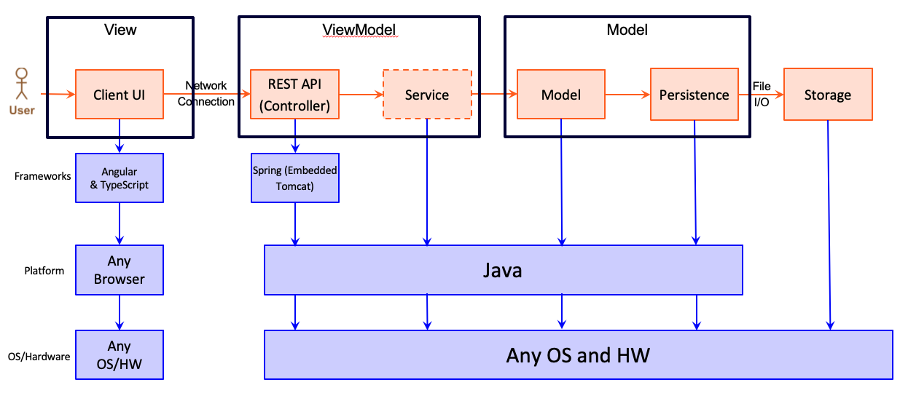

# PROJECT Design Documentation

## Team Information
* Team name: Myriad Desserts
* Team members
  * Giselle
  * Chaitanya 
  * Avasyu
  * Ammar
  * Mohammed

## Executive Summary

This project entails the development of an e-store for Myriad Desserts, a confectionary shop. Myriad Desserts is a modernized version of a traditional confectionary store where customers can choose a product and customize certain ingredients to their liking.

### Purpose

The objective of this project is to create and launch an online store for Myriad Desserts Confectionary. Customers and employees are the primary users of this e-store. Customers will be able to view a list of products, choose a product, and customize the ingredients of a specific product through this e-store. Employees of the store are another group of users who can use the e-store interface to manage inventory of required supplies. 

### Glossary and Acronyms

| Term | Definition |
|------|------------|
| API | Application programming interface |
| JSON | Java Script Object Notation |
| OOP | Object Oriented Programming |
| URL | Unifrom Resource Locator |
| REST | Representational State Transfer |
| SPA | Single page |
| MVP | Minimum Viable Product |

## Requirements

* As an Employee, I want to be able to view inventory details to maintain stock.
* As an Employee, I want to see a list of inventory items so that I can select an item.
* As an Employee, I want to add an inventory item so that it is included in the list of inventory items.
* As an Employee, I want to edit an inventory item so that the changes are made and shown in the inventory.
* As an Employee, I want to delete an inventory item so that it is no longer is visible on the inventory list.
* As an Employee, I want to get notifications on products that are running low on stock so that I can restock them. 
* As an Employee, I want to login into the admin account so that I can perform inventory management.
* As an Employee, I want a notification when stock reaches low level so that I can resupply inventory when needed.
* As a Customer, I want to create an account so that I can order products. 
* As a Customer, I need to add and remove products from the cart so that i can purchase what I want.
* As a Customer, I want to login into my account so that I can view a list of products
* As a Customer, I want to add and remove ingredients from my selected product to make edited product.
* As a Customer, I want to edit the shopping cart so I can make changes in my order preferences. 
* As a Customer, I want to be able to use checkout on my cart so that I can place an order
* As a Customer, I want to be able to choose products to be in the cart in order to purchase them.
* As a Customer, I want to see a Create Account option so that I can successfully complete Account Registration with the e-store.
* As a Customer, I want to be able to edit the ingredients so that I can make a customized product. 
* As a Customer, I want to finalize my preferences shown on the shopping cart so I can confirm my order. 

### Definition of MVP

The MVP must have the ablility to customize a selected product using the list of ingredients shown to the customer. The customized product should then be added to the cart when the customer adds to the cart and should display the list of ingredients, along with the default ingrdients, selected for the product in the cart.

### MVP Features

* Getting entire inventory
* Display ingredients of a product
* Update a product
* Get a single product
* Delete a single product
* Customer Log in
* Employee Log in
* Add to cart
* Delete item from cart
* Edit shopping cart 
* Checkout

## 10% feature

* Display list of ingredients for a product
* customize product by editing and selecting ingredients
* add customized product to the shopping cart

### Roadmap of Enhancements
* automated inventory management
* generate order invoice
* payment services

## Application Domain

This section describes the application domain.

The domain model shown above highlights key entities such as Customer, Account, Inventory, and Shopping Cart. The relationships between these entities are crucial and should run smoothly in order for the store to function as smoothly as possible. The e-store's functionality primarily involves entities such as Customer, Product, and Shopping Cart.

The following is the flow and relationship between the various important domain entities:
The customer first logs into their account, where their name, username and password is stored. The Account is used to direct customers to the login page where they can see the Product. The Product is then selected and added to shopping Cart, or the Product can be customized using ingredients available in the inventory and then add the customized product to the cart. The Customer can checkout of the shopping cart when they have finalized the selected items. Upon checking out of the shopping cart, Customers will be notified of the total price and an Order is placed. Meanwhile, Employees manage the inventory system, which is supplied by respective suppliers to replenish the stock.

## Architecture and Design

This section describes the application architecture.

### Summary

The following Tiers/Layers model shows a high-level view of the webapp's architecture.

The e-store web application, is built using the Model–View–ViewModel (MVVM) architecture pattern. 

The Model stores the application data objects including any functionality to provide persistance. 

The View is the client-side SPA built with Angular utilizing HTML, CSS and TypeScript. The ViewModel provides RESTful APIs to the client (View) as well as any logic required to manipulate the data objects from the Model.

Both the ViewModel and Model are built using Java and Spring Framework. Details of the components within these tiers are supplied below.

### Overview of User Interface

Once the angular webpage is running the users are greeted with the login page. If the user hasn't created an account yet they will have to click the sign up button. Once the user signs up and logs in with the user credentials then they would see the products page. Here the user can add the products to the cart and customize and then the user can see the cart once again and checkout after which they would be returned to the  main menu. On the other hand if the product manager logs in as an admin then he can see the products page and can also change the quantity price and other aspects of each product and also add or remove products itself.

### View Tier
The view tier is the UI that users see when they access the application. This tier is reponsible for outputting neccessary information to the user and prompting input information from the user as well. The UI components mainly deal with showing essential components required for login, showing products, showing shopping cart and so on. For a specific component like products, when users login with their account, the UI is responsible for displaying a list of products. The UI communicates with the backend to display list of products. Once the neccesary infromation from the backend has been obtained, the presentation tier then formats and represents this list of items to the client. This is further illustrated in the sequence diagram in the next section. 

### ViewModel Tier
This tier enables the view and model tier to communicate with each other to ensure that user can easily interact with the application. This includes RESTful APIs in the View Tier and data objects from the Model. In the instance, of where the product list needs to be retrieved from the backend, an HTTP GET Request from the View tier is sent to the backend. This request is sent to the controller to fetch the product list. The list is then sent back to the frontend to be displayed. 

The components that exist in the view tier of the e-store are:
1. Login Page
2. Dashboard
3. Shopping Cart page

Below is the sequence diagram for obtaining and displaying list of products:

### Model Tier
This tier deals with the data that have been stored in the backend and will be utilized to either be displayed and/or edited by respective users. In the example of login and registration, when the user first comes across the login page, they are prompted to enter a username and password, for which a json server is running in the background to authenticate the credentials inputted. The page template contains static and dynamic content that is populated using the json server. 

### Design Principle Analysis
This section describes few areas that show how our project abides by the design principles (found in both frontend and backend)

- There is a controller that forms a separation between the interface and the backend for the product where the controller takes information (generally based on MVP) from the interface and then uses it for the complex system operations.

- Instead of making the Customer and Employee classes handle the credentials, we created an Account class to handle the credentials of the user. This way we show that the Account class follows the single responsibility design principle and we removed the extra responsibility from the Customer and Employee classes. This is illustrated in the diagram above. 

- The Customer Account and Employee Account store the passwords which then are used by the Account class to do its functionality. This way we show pure fabrication and also enhance the single responsibility state of the Account class. 

### Static Code Analysis/Design Improvements
Static code analysis allows us to detect any issues in our software and gives suggesstions on how to improve or fix these problems. We will use sonarQube to detect the issues. Some  of the problems that arise could becommented code while others could involve improving naming conventions for variables or methods. In addition to this, the tool gives a rank for the severity of the problem from info being the lowest to blocker being most severe. 

Below are screenshots that shows problems in our base code. For each screenshot, we address the needed design changes and recommend design improvements:

As Shown above, both our frontend and backend are bug free with A rating. Having no bugs means that there won't be an unexpected error during runtime which is important for a business. In addition, no vulnerability means that the code is secure from outside attacks. However, we have alot of code smells, which mainly affect the maintability of the code. In other words, having high amount of code smells would mean that its very tricky to maintain. Below are some example of the code smells we have with the improvements suggested to mitigate them.

This issue is regarding commented code. The recommended suggestion would be to delete as it won't be used and would be deemed unneccesary.

This code segment was another part that could be improved. In relation to the backend that we have developed, there are few classes that are seemed to be imported but not have been used. It is recommended to throughly scan through the code to search for unused imported classes, and remove these for better code readability and functionality.

For this segemnt, two unusual coding practices appear that need to be edited. The first coding practice that needs to be ammended is using TRUE instead of !=false in regards to returing and working with boolean data types. Second coding practice noticed is not having proper indentation under the else statement to show which of the lines under the else belong to it. This could be easily rectified by consistently implementing identation for programming. 

Finally in this segment we have unused code that needs to be removed to avoid confusion in future maintenance of the code.

In addition to the above design recommendations, we recommend the following:

Although our project was well designed there are a few design improvements to make our project better. In our project it was seen that only the ingredients were being linked to the customize function, but the products were static. We would like to change this for the future improvements and design our project in a way that managers are able to create new products add them to the catalogue. In the future we would also like to add functionality for searching the products from our catalogue as the managers can create new projects it can become hard for the customers to find a particular product. Finally, one minor design change that we would like to make that’s linked to the UI is that, when the ingredients are being added to create a custom product there are no visual cues to see what ingredients have been added so that the user can confirm it instead of going to the cart to check it.

## Testing

### Acceptance Testing
In our Acceptance Test plan there is a total of 13 user stories and 28 Acceptance criterion. All of have the PASS status. None of the tested User stories are failing or experiencing bugs. 

Below are User Stories and Acceptance Criterion as seen in the Acceptance Test Plan. 

### Unit Testing and Code Coverage
**Controller Tier**
_Analysis_

The Controller tier has a coverage percentage of only 87%. This is mainly due to the fact of fewer test conditions were implemented to test potential failure scenarios. One of the fail scenarios includes passing a null object as a parameter to the method. 

A few suggestions to improve the coverage rates for this specific tier could be :
1.	Focus on implementing test conditions for areas of code that are most likely to have bugs or disrupt the functionality of the code, like passing a null object as a parameter
2.	Create tests for specific parts of the code that support the main functionality first, and debug any errors related to the test code before moving on to the next important part of the code. This eases the debugging process if required. 

**Model Tier**
_Analysis_

The results of our model tier tests show that we have validated each and every one of the functions that make up our method, including all of the exceptions and any other potential failure areas, except for Item. Apart from Item, the results of our tests on the model tier suggest that there is 100% coverage and indicates that all methods have been tested and functioned as intended. The methodology and structure for testing this particular class could be used to improve the coverage rates for Item in this tier. 

**Persistence Tier**
_Analysis_

According to the report, there is 97% coverage for the persistence tier. The remaining percentage occurs due to a lack of test statements to test scenarios where a null object might be passed as a parameter, where a Status code of Not Found would ideally be outputted. The persistence tier is mainly constitutes the ProductFileDAO, which contains methods about the product that is important for our software. Therefore, it is essential that we add the missing tests to make it reach a 100% coverage rate in order to avoid having any unexpected bugs in the future.

As suggested before, we could implement tests that are more directed towards testing the main functionalities of the code, which could include designing tests intended to deal with scenarios where the program could fail. 

Another suggestion for improving coverage rates would be setting a proper methodology of how to implement tests. To ensure consistency, a common checklist could be created that could be applicable to similar methods, to test the most common scenarios. 

**Well-tested Component**

The Product class under the Model tier has been well-tested. As the figures above shows, there is a small percentage of missed instructions or any missed branches, and there is good testing coverage of all the methods shown. This helps indicate that the code is working as intended. The code for this component represents well-tested code that is efficient, dependable and consistent CI/CD. 

**Poorly-test Component**

Although few gaps in coverage have been noticed across most tiers, the class Item under the Model tier has the most significant gap in terms of coverage. Item has only 47% coverage. This percentage of missed branches and missed instructions are the highest compared to other classes in other tiers.

